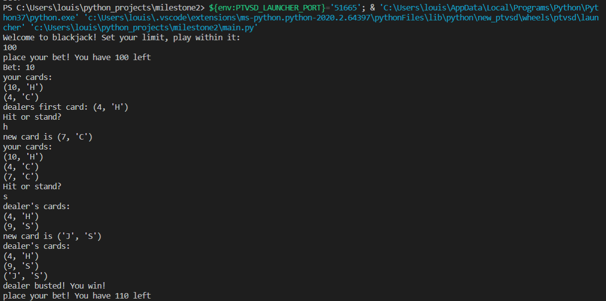

# Text-Based-Blackjack-Game
Play standard blackjack against an automated dealer, hit or stand to win your virtual bets

## How to set up

* clone repo
* run main.py with Python (preferably 3) in your cmd window or favorite IDE!

## Once you're set up
* set your bet limit
* place a bet
* decide whether to hit or stand
* win it all!

## Example Game

## Inspiration
This was a milestone project I completed on my way to completing a python bootcamp course on Udemy
